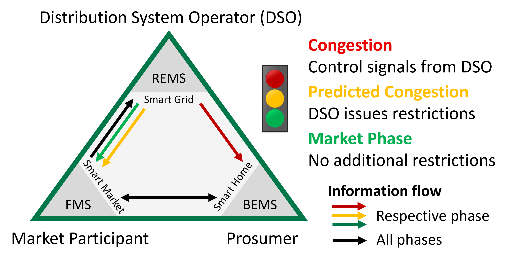
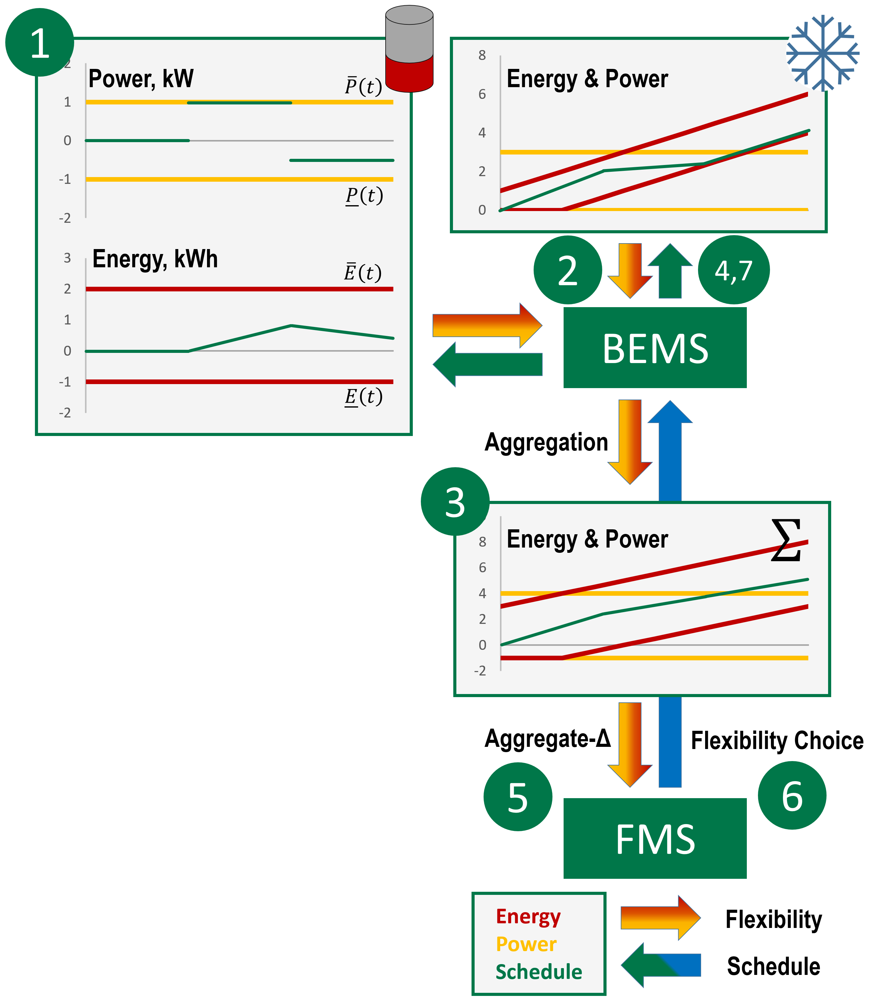

# gridcontrol-bems
The building energy management system (BEMS) that has been devloped for the research project [grid-control](http://projekt-grid-control.de/). 

__Please Note:__
- We are still updating and fixing bugs at this stage of the project
- More Information will follow

One central goal of grid-control is the impementation of the BDEW smart grid traffic light concept that assigns traffic light phases to each network semgent.

Each grid segment is assigned with a traffic light phase representing its estimated current state. A building energy management system (BEMS) interacts with its associated market participant through a Flexibility Management System (FMS). The FMS is used for publishing schedule forecasts bundled with an aggregated flexibility and for receiving target schedules. Red traffic light phases are detected by the Regional Energy Management System (REMS) which can issue control signals to the BEMS during a red phase.

In this context, the BEMS collects local flexibility using a generic interface, conducts optimization for self-consumption and offers an aggregated flexibility to a participant of the energy market.
During a red traffic light phase the BEMS interrupts its normal operation and controls the local devices according to the signals provided by the distribution system operator.

## Flexibility Interface

Flexibility  is expressed as corridors of power and energy:
Power at time t: 𝑝(𝑡)∈[▁𝑃 (𝑡),𝑃 ̅(𝑡)]
Energy flow till time t: 𝑒(𝑡)∈[▁𝐸 (𝑡),𝐸 ̅(𝑡)  ]
Either power or energy is chosen during optimization while the remaining value defines a restriction. Additional restrictions can be added.

The BEMS offers an aggregated flexibility to the associated market participant (MP):
1. Flexibility is determined by stand-alone drivers based on forecasts, user inputs and other operational restrictions.
1. Flexibility is collected by the BEMS.
1. Based on forecasts, self-consumption is maximized and the resulting device schedules are used to determine an aggregated flexibility.
1. Planned device schedules are passed to the drivers.
1. Planned schedule and aggregated flexibility (with 𝑓(𝑡)≡0 representing the planned schedule) are send separately to the MP.
1. The MP decides on their flexibility demand and tells the BEMS.
1. The BEMS fulfils the MP‘s choice in real-time by adapting the schedules.

##Links

[Demo Abstract, 2017](https://www.springerprofessional.de/demo-abstract-a-building-energy-management-system-in-the-context/14230544)