# Systembeschreibung - Gebäude-Energiemanagementsystem

__Inhalt:__

- __Systembeschreibung - Gebäude-Energiemanagementsystem__
  - [Konzeptbeschreibungen](#concept)
  - [Schnittstellen des Systems nach außen](#interfaces)
    - [Nutzerschnittstelle](#interfaces_user)
    - [Zähler](#interfaces_meter)
    - [Batteriespeicher](#interfaces_battery)
    - [Flexibilitätsmanagementsystem](#interfaces_fms)
    - [Datenspeicher zur Erfassung von Messwerten](#interfaces_storage)
    - [Regionales Energiemanagement System](#interfaces_rems)
    - [Zusätzliche externe Steuerbefehle](#interfaces_control) 
  - [Systemaufbau](#system) 
    - [Hardware](#system_hardware)
    - [Software](#system_software)
  - [Funktionen der Komponenten](#functions)
    - [Annahmen](#functions_assumptions)
    - [Notwendige Inputdaten / Datenbasis](#functions_input)
    - [Datenerfassung und interne Datenweitergabe](#functions_data)
	- [Der Optimierungsprozess](#functions_optimization)
	- [Flexibilität](#functions_flexibility)
	- [Prognose](#functions_forecasts)
	- [Output/ Ausgangsgrößen](#functions_output)
	- [Visualisierung](#functions_visualization)
	- [Datenablage](#functions_data-storage)
	- [Offene Use Cases/ Forschungsbedarf der Out Of Scope war](#functions_out-of-scope)
  - [Erprobung des Systems](#results)
    - [Notwendige Anpassungen](#results_adaptations)
    - [Flexibilitätserbringung](#results_provision)
    - [Prognosegüte](#results_forecasts)
- [Literatur](#references)

## Konzeptbeschreibungen

Das Gebäude-Energiemanagementsystemen (GEMS) ermöglicht durch die Koordination von Erzeugern, Verbrauchern und Speichersystemen nicht nur eine lokal optimierte Energienutzung, sondern auch die Erstellung von Einspeise- und Verbrauchsprognosen, sowie die Bereitstellung von Flexibilitätspotentialen für die Marktseite. In einer zukünftigen Anwendung wird das GEMS entweder durch die Prosumer selbst erworben und betrieben, z.B. mit dem Ziel Energiekosten zu sparen, oder von der Energiemarktseite zur Verfügung gestellt. 

Die primäre Aufgabe des im Rahmen von grid-control adaptierten GEMS ist die Steuerung der im Gebäude oder auch Haushalt verfügbaren Geräte unter Einhaltung der lokalen Restriktionen  von Gebäude, EMT und Bewohner. Im Folgenden wird der Einfachheit wegen nur noch von Gebäuden gesprochen. Die Flexibilität, welche sich aus den Möglichkeiten zur Steuerung der flexiblen Anlagen ergibt, wird für zweierlei Ziele genutzt. Zunächst werden in der Planung lokale Ziele, welche beispielsweise durch den Prosumer vorgegeben sind, möglichst gut erfüllt. Im Rahmen des Projekts wurde im Sinne des Prosumers der Eigenverbrauch als Zielgröße gewählt, was bei einem fixen Stromtarif im Zusammenhang mit den eingesetzten Anlagen (Erzeuger, Speicher, Verbraucher) die Energiekosten minimiert. Das sich aus dieser Planung ergebende Lastprofil des gesamten Gebäudes dient dann als Referenz für das Angebot der Flexibilität. Die angebotene Flexibilität ergibt sich aus der in der Planung verfügbaren Flexibilität. In Abhängigkeit der Verträge zwischen Prosumer und Marktteilnehmer kann dieses Angebot durch das GEMS beschränkt werden, so dass in den beiden Extremfällen dem Marktteilnehmer entweder die komplette Flexibilität oder keine Flexibilität angeboten wird. Die Erbringung der Flexibilität wird gemessen am tatsächlich realisierten Lastprofil des Gebäudes. Findet kein Abruf statt, so wird das Lastprofil entsprechend der Planung realisiert, um Planungssicherheit im Verteilnetz zu gewährleisten. Der Austausch von Informationen zur Flexibilität findet möglichst generisch statt. Es ist daher möglich beliebige Geräte im Gebäude zu integrieren. Im Projekt beschränkte sich das Flexibilitätsangebot jedoch nur auf einzelne Batteriespeicher verteilt auf verschiedene GEMSe. Lokal vorhandene Flexibilität wird nur als Aggregat an dem Marktteilnehmer kommuniziert. Bei einem Angebot aus einem Gerätepool wird so die gezielte Steuerung von Geräten durch den Marktteilnehmer erschwert und somit die Autonomie des Gebäudes erhöht. Um Eingriffe durch den Netzbetreiber bei einer roten Ampelphase zu ermöglichen bietet das GEMS eine Schnittstelle an über die Steuerbefehle entgegengenommen werden können. Auf Verlangen des Netzbetreibers wird dann, durch das GEMS, der planmäßige Betrieb unterbrochen und die Steuerung entsprechend der Vorgabe umgesetzt. Das GEMS gibt jedoch zu keinem Zeitpunkt die Kontrolle auf.
Um dem Prosumer auch abseits der Steuerung von Geräten einen Mehrwert zu bieten und somit auch die Akzeptanz zu erhöhen, bietet das GEMS eine simple Nutzeroberfläche zum Betrachten der Stromflüsse an auf die per Einwahl in ein geschütztes WLAN zugegriffen werden kann.
 

## Schnittstellen des GEMS nach außen 

Dieser Abschnitt widmet sich der Darstellung der Schnittstellen des GEMS zu anderen Systemen hin.
Für eine detaillierte Beschreibung der jeweiligen Systeme sei auf den Abschlussbericht des Projekts und die jeweiligen Veröffentlichungen verwiesen.
Eine kurze Übersicht der nicht GEMS-eigenen Systeme kann der folgenden Tabelle entnommen werden:

|System|Beschreibung|
|---|---|
|Flexibilitätsmanagementsystem (FMS)|System des externen Marktteilnehmers (EMT) zur Erfassung und beeinflussung der vorhandenen Flexibilität|
|Regionales-Energiemanagementsystem (REMS)|Kann steuernd eingreifen sobald eine rote Ampelphase eintritt|
|Grid-Control-Unit (GCU)|Erweiterungsmodul das die Kommunikation mit dem REMS ermöglicht|
|netfiles|Datenaustauschplattform auf die mittels SFTP zugegriffen wird. Sie dient dem Austausch von Daten.|

Der GEMS-Kern selbst ist vom Organic Smart Home (OSH) abgeleitet und nutzt die Zeitreihendatenbank _influxdb_, sowie die Kommunikationsplattform  _Crossbar_.

Die folgende Abbildung illustriert die Architektur des GEMS und dessen Schnittstellen zu anderen Systemen sowie den Prosumern. Im Folgenden wird der Prosumer auch Nutzer genannt.
 
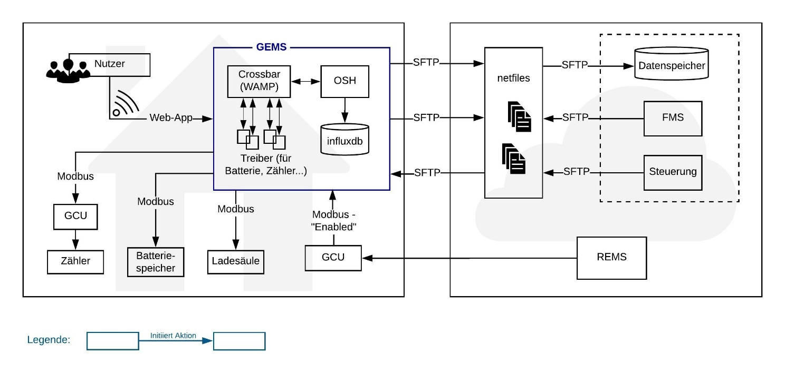

 
### Nutzerschnittstelle 

Die Nutzerschnittstelle dient als Dankeschön an die Nutzer, damit diese über die Vorgänge im Haus aufgeklärt werden, um so die Transparenz und auch die Akzeptanz zu erhöhen. Über ein vorkonfiguriertes Tablet, welches den Nutzern zur Verfügung gestellt wurde, können diese einfach auf die Oberfläche zugreifen. Diese Web-App wird per verschlüsseltem WLAN durch das GEMS, welches als Hotspot agiert, ausgeliefert.
Die aktuelle elektrische Leistung der Photovoltaik-Anlage, die Netzeinspeisung, der Stromverbrauch und die Leistungsaufnahme des Speichers können in kW abgerufen werden. Zusätzlich wird der aktuelle Ladungszustand des Speichers in kWh dargestellt. Diese Messwerte können außerdem über den Zeitraum der letzten 24 Stunden angezeigt werden.
Eine genauere Darstellung der Nutzerschnittstelle findet sich im Abschnitt [Visualisierung](#functions_visualization).

### Zähler

Das GEMS liest die Zählerwerte von der GCU über das Modbus-Protokoll aus. Die GCU wiederum liest dafür die Daten aus dem Zähler aus. Folgende Informationen werden jede Sekunde von der GCU erfragt:

|Information|Register|Anmerkungen|
|---|---|---|
|Aktueller Zeitpunkt (time)| - | |
|Wirkleistung (totalActivePower)|Register 15, 16|
|Blindleistung (totalReactivePower)|Register 17, 18|
|Positive Wirkenergie (totalActiveEnergyP)|Register 43 - 46|
|Negative Wirkenergie (totalActiveEnergyN)|Register 47 - 50|
|Alarm Flag (alarmFlag)|Register 75 - 78|

### Batteriespeicher

Das Auslesen der Informationen des Batteriespeichers und auch das Schreiben erfolgen ebenso über das Modbus-Protokoll. Folgende Informationen werden aus dem Speicher über den „StoraXe System Master Controller“ ausgelesen:

|Information|Register|Anmerkungen|
|---|---|---|
|Netzzustand (gridState)|Register 1|Kann die Werte Off, Island Mode, Online oder Error annehmen
|Wirkleistung (realPower)|Register 2|
|Blindleistung (reactivePower)|Register 3|
|Cosinus Phi (cosPhi)|Register 4|
|Phasen Modus (phaseMode)|Register 5|Kann die Werte Capacitive, Inducitve annehmen
|Maximale Ladeleistung (Wirkleistung) (maxRealPowerCharge)|Register 14|Wert ist nicht konstant
|Maximale Entladeleistung (Wirkleistung) (maxRealPowerDischarge)|Register 15|Wert ist nicht konstant
|Ladezustand (stateOfCharge)|Register 126|Ist der Ladezustand echt unter dem minimalen Ladezustand oder echt über dem maximalen Ladezustand wird der Batteriespeicher mit 1000 W ent- bzw. beladen.
|Batteriezustand (stateOfHealth)|Register 127|
|Batteriezustand (batteryState)|Register 142|Kann die Werte Off, Start Up, Balancing, Ready, Operating, Error annehmen
|Gespeicherte Energie, die in Höhe der Nennleistung als Wechselstrom entladen werden kann bis das System leer ist oder die Nennleistung nicht mehr erreicht werden kann (energyUntilEmpty)|Register 144, 145|
|Energie, die in Höhe der Nennleistung als Wechselstrom geladen werden kann bis das System voll oder die Nennleistung nicht mehr erreicht werden kann (energyUntilFull)|Register 146, 147|
|Systemstatus (systemState)|Register 201|Kann die Werte Off, Balancing, Auto, Island Mode, Line Commutated, Standby, Sleep, Error annehmen
|System Error Codes (systemErrorCode)|Register 236 - 239|

Folgende Informationen werden zu dem Speicher geschrieben:

|Information|Register|Anmerkungen|
|---|---|---|
|Zielwirkleistung (realPowerReq)|Register 32|
|Zielwirkleistung in Phase L1 (powerL1Req)|Register 36, 37|Nur wenn Batterie an Dreiphasen-Wechselstrom angeschlossen ist. Darstellung erfolgt im Zweierkomplement. Leistung in Richtung Batterie ist negativ.
|Zielwirkleistung in Phase L2 (powerL2Req)|Register 38, 39| s.o. |
|Zielwirkleistung in Phase L3 (powerL3Req)|Register 40, 41| s.o. |
|Systemstatus (systemStateRequest)|Register 244|Kann die Werte Off, Balancing, Auto, Island Mode, Line Commutated, Standby, Sleep, Error annehmen

### Flexibilitätsmanagementsystem

Die Kommunikation zwischen dem Flexibilitätsmanagementsystem (FMS) und GEMS erfolgt ebenso über die Datenaustauschplattform und das SFTP-Protokoll. Die Daten werden als Dateien im Datenformat „DataLink Format 4“ aus dem Hause seven2one ausgetauscht.

Das GEMS nutzt das Verzeichnis __(FZI/)GEMS_FMS/VZP/DATEI__, wobei __VZP__ einen virtueller Zählpunkt (vZP) und somit ein GEMS-spezifisches Unterverzeichnis darstellt. __DATEI__ entspricht dem Namen der eigentlichen Datei. Das FMS nutzt in analoger Vorgehensweise das Verzeichnis __(seven2one/)FMS_Export/VZP/DATEI__.

#### GEMS zu FMS

Indem die gegebenenfalls vorhandene alte Datei mit gleichem Namen überschrieben wird, legt das GEMS auf der Datenaustauschplattform folgende Dateien ab:
- Den initialen Fahrplan und Flexibilität als „schedule_initial.csv“ 
- Ein Update des Fahrplan und Flexibilität als „schedule_update.csv“
- Den Trigger „Wunschfahrplan abgelehnt“ als „schedule_request_denied.csv“ 
Zur Archivierung wird außerdem gleichzeitig zum Upload je eine Kopie erstellt, welche um einen Zeitstempel nach ISO-860 mit „-“ anstelle von „:“ vor dem Dateinamen ergänzt wird.

Dieser Upload geschieht dann, wenn bisher noch kein Fahrplan gemeldet wurde („schedule_initial.csv“) oder der Vergleich mit dem Zielfahrplan eine zu große Abweichung ergeben hat („schedule_update.csv“).

#### FMS zu GEMS

Das GEMS prüft alle 5 Minuten in folgender Reihenfolge, ob eine dieser Dateien vom FMS abgelegt wurde:
1. Der Zielfahrplan als „schedule_target.csv“
2. Ein Update des Zielfahrplan als „schedule_target_update.csv“
3. Ein Wunschfahrplan „schedule_request.csv“

Nach erfolgreichem Download ergänzt das GEMS den Dateinamen um den aktuellen Zeitstempel vor dem Namen. Schlägt das Einspielen fehl, werden der Datei ein „FAILED“ und der aktuelle Zeitstempel vorangestellt. Im Gegensatz zum Zielfahrplan kann das GEMS den Wunschfahrplan ablehnen und dies durch eine entsprechende Meldung (siehe oben) kenntlich machen.

Der Fahrplan und die Flexibilität sind als Menge von Zeitreihen mit einer Auflösung von 15 min dargestellt. Die Generierung des Fahrplan und der Flexibilität ist genauer unter dem Punkt „Datenverarbeitung/Berechnungen“ beschrieben.

#### Fahrplan
Der Fahrplan, den das GEMS erstellt, enthält die unter (1) dargestellten Informationen. Wobei das FMS (1) sowie die separat gemeldete Flexibilität nutzt, um (2) unter Berücksichtigung aller initialen Fahrpläne zu ergänzen. Ein Fahrplan enthält demnach:

__(1)__:
- Source – jeweiliger Energiemarktteilnehmer
- UE in kW – durchschnittliche unflexible Einspeisung
- UL in kW – durchschnittlicher unflexibler Verbrauch, der nicht geändert werden kann

UE und UL werden durch lokale Optimierung der Flexibilität zur Eigenverbrauchsoptimierung (siehe auch [Optimierung](#functions_optimization)) vom GEMS bestimmt.

__(2)__:
- FL in kW – durchschnittlicher veränderbarer Verbrauch
- FE in kW – durchschnittliche flexible Einspeisung 

Diese beiden Werte bleiben 0, bis das FMS sie innerhalb der Grenzen der separat gemeldeten Flexibilität bestimmt und überschreibt.

#### Flexibilität

Die Flexibilität wird mit Hilfe von Energie- und Leistungskorridoren dargestellt:
- Leistung p zur Zeit t: 𝑝(𝑡)∈[P̲ (𝑡),P̅(𝑡)], Treppenfunktion, rechtsstetig. Wert wird zu Slot-Beginn gesetzt.

  - LeistMIN_P in kW – Untere Schranke für Leistungsangebot
  - LeistMAX_P in kW – Obere Schranke für Leistungsangebot
  
- Energie e zur Zeit t: 𝑒(𝑡)∈[E̲ (𝑡),E̅(𝑡)], lineare Interpolation, stetig

  - EnergieMIN_E in kWh – Untere Schranke für Energieangebot
  - EnergieMAX_E in kWh – Obere Schranke für Energieangebot

Genauere Erklärungen zur Flexibilität folgen im Abschnitt [Flexibilität](#functions_flexibility).

### Datenspeicher zur Erfassung von Messwerten

Das GEMS speichert die von den Zählern erfassten Messwerte gemäß dem hinterlegten Abfrageintervall von einer Sekunde in eine Influxdb. Bei Influxdb handelt es sich um eine Datenbank speziell für die Verarbeitung von Zeitreihen.
Zur Archivierung und Verfügbarmachung der Messwerte wird ebenfalls die Datenaustauschplattform genutzt, wobei der Zugriff über das SFTP Protokoll erfolgt.
In jeder Nacht, zu einer zufälligen Zeit zwischen 3 und 4 Uhr, um Überlastungen im Funknetz zu vermeiden, werden die Messdaten aus der Influxdb in 1-minütiger Auflösung an den Datenspeicher übertragen.

### Regionales Energiemanagement System

Das Kommunizieren von Informationen zwischen dem Regionalen Energiemanagement System (REMS) und GEMS erfolgt über das Modbus-Protokoll mittels einer GCU.

Das REMS registriert die rote Ampelphase und sendet ein „Disable“ Signal und eine „Dead time“ Information an das GEMS. In dieser Phase übernimmt das REMS (indirekt) die Kontrolle, indem es dem GEMS Steueranforderungen sendet, die dieses umsetzt. Wenn die Ampelphase wieder grün oder gelb ist, so sendet REMS ein „Enable“ Signal und eine „Dead time“ Information an GEMS. Das GEMS kann folglich nicht zwischen den Phasen grün und gelb unterscheiden, da Gelbphasen im Projekt nur in der Day-Ahead Planung auftreten können.

Informationen zu Zählern, dem Batteriespeicher und der Ladesäule werden mittels GCU in 60 Sekunden Abständen an das REMS übertragen.

### Zusätzliche externe Steuerbefehle 

Um das GEMS für Testzwecke beeinflussen zu können wurde eine Steuerungsschnittstelle geschaffen. Diese kann mit Hilfe der Datenaustauschplattform angesprochen werden. Der Zugriff auf die Datenaustauschplattform erfolgt über das SFTP Protokoll. Steuerbefehle werden durch eine Steuerdatei („execute.csv“) abgelegt. Das GEMS überprüft alle 5 Minuten, ob eine neue Datei vorhanden ist. Falls dies der Fall ist, wird diese heruntergeladen und umgesetzt. Dem Dateinamen wird anschließend vom GEMS der aktuelle Zeitstempel vorangestellt, um diese Datei so zu archivieren und ein erneutes Herunterladen zu verhindern.

In der Steuerdatei enthält jede Zeile einen Befehl, wobei Leerzeilen und mit „#“ beginnende Zeilen ignoriert werden.

## Systemaufbau 

### Hardware

Als Hardwareplattform dient ein Raspberry Pi Model 3b mit folgender Ausstattung:

	CPU: 1.2GHz 64-bit quad-core, ~ 180 MFLOPS
	1GB RAM
	Ethernet Port - Verschaltung mit anderen Komponenten
	802.11n Wireless LAN - Auslieferung der GUI per WLAN Hotspot

### Software

Folgende Software und Bibliotheken werden durch das GEMS genutzt.

	Datenbank: InfluxDB
	Messdaten werden hochaufgelöst gespeichert, je nach Konfiguration für:
	  - Zähler Batteriespeicher
	  - Zähler Verbrauch
	  - Zähler PV
	  - SoC Speicher (bei Änderung)

	Kommunikation: Crossbar.io (WAMP Router)
	Zur Kommunikation zwischen den (internen) Komponenten.
	(Publish und Subscribe oder Routed Remote Procedure Calls)

__GEMS-Kern__:

	Java Version 1.8
	Bibliotheken/Frameworks: 
		OSGI
		Jawampa (WAMP Client)
		RxJava 	(ReactiveX)
		Jackson (Json)
		Netty 	(Websocket)
		Gson 	(Json)
		Jamod 	(Modbus)
		Jsch	(SFTP)
		Netty	(Webserver)

Fernzugriff auf das GEMS ist per SSH möglich

__Watchdog__:

	Java Version 1.8

Der Watchdog dient der Überwachung des GEMS. Er ist in der Lage Ausfälle zu erkennen und versucht diese durch einen Neustart der entsprechenden Komponenten automatisiert zu beheben.

## Funktionen der Komponenten

Der Kern des GEMS hat keine direkte Schnittstelle zu den verwendeten Geräten und Anlagen. Die Kommunikation erfolgt mittels sogenannter „Treiber“, welche eigenständige Softwaremodule sind. Die in diesem Abschnitt beschriebenen Schnittstellen sind nicht die Schnittstellen zwischen Gerät und dem GEMS-Kern, sondern die Schnittstellen zwischen den Treibern und dem GEMS-Kern.

### Annahmen

Es wird in der Optimierung angenommen, dass die Prognosen für den Stromverbrauch, sowie die –Erzeugung perfekt sind. Das heißt während der Optimierung werden die Vorhersagen nicht als stochastisch angenommen. Außerdem werden in der Optimierung Rotphasen nicht berücksichtigt, da diese nur in Ausnahmefällen zu erwarten sind und ohne entsprechende Datenbasis auch nur schwer durch ein einzelnes GEMS vorhersehbar sind.

### Notwendige Inputdaten / Datenbasis

Notwendige Daten, die dem GEMS zur Verfügung gestellt werden müssen, sind Daten zum Batteriespeicher und der Zählerstand über die GCU (siehe jeweils die folgenden Abschnitte), aus welchem sich der momentane Verbrauch und die momentane Produktion berechnen. Außerdem werden historische Verbrauchs- und Produktionsdaten, welche als Zeitreihen in der InfluxDB liegen, benötigt um Prognosen ermitteln zu können. Fehlen diese, werden naive Prognosen auf Basis eines Standardlastprofils genutzt.
Weiter sind die Fahrpläne vom FMS, das Ampelsignal vom REMS über die GCU, sowie Konfigurationsdateien erforderlich. Letztere enthalten die Festlegung verschiedener Größen wie Puffer, Kommunikationsfrequenzen oder sonstige Daten auf die gewünschten Werte. Hier wird aufgrund des Umfangs darauf verzichtet, diese Dateien näher zu beschreiben. Unter https://github.com/kfoerderer/gridcontrol-bems können im Source Code der einzelnen Module, jeweils im Unterordner ‚configuration‘, die entsprechenden Dateien eingesehen werden. Diese können bei der Konfiguration mittels JSON-Dateien überschrieben werden.

### Datenerfassung und interne Datenweitergabe

Die gesammelten Messdaten werden immer beim Eintreffen neuer Werte, z.B. sekündlich oder minütlich (je nach Konfiguration der Treiber für Zähler Speicher, Verbrauch, PV) in der Influxdb gespeichert.

#### Batterietreiber: Datenerfassung vom Batteriespeicher und interne Weitergabe 

Informationen zum Batterietreiber selbst: 

|Information|Anmerkungen|
|---|---|
|Setzen und Auslesen des Treiberstatus (DriverState)|Kann die Werte Off, Standby, On, Unknown annehmen. Ist der Treiberstatus auf Standby werden keine Anweisungen des REMS angenommen („Enable“ signal).|

Informationen zur REMS-Batteriekontrolle, die an den Batterietreiber weiter gegeben werden:

|Information|Anmerkungen|
|---|---|
|Zielwirkleistung|Siehe unter [Batterie](#interfaces_battery): Informationen, die zum Batteriespeicher geschrieben werden.

Informationen zum Batteriespeicher, die vom Batterietreiber vorgehalten werden:

|Information|Anmerkungen|
|---|---|
|Effektiver Ladezustand (effectiveStateOfCharge)|Prozentualer Wert|
|Effektive Leistung in Wh (effectiveCapacity)|Berechnet aus Nennleistung, Maximalem und Minimalem Ladezustand der Batterie|
|Nennleistung der Batterie in Wh (nominalCapacity)||
|Maximale Ladeleistung (Wirkleistung) (maxRealPowerCharge)|Wert ist nicht konstant|
|Maximale Entladeleistung (Wirkleistung) (maxRealPowerDischarge)|Wert ist nicht konstant|
|Wirkleistung (realPower)||
|Ladezustand (stateOfCharge)|Ist der Ladezustand echt unter dem minimalen Ladezustand oder echt über dem maximalen Ladezustand wird der Batteriespeicher mit 1000 W ent- bzw. beladen.|
|Batteriezustand (stateOfHealth)||
|Systemstatus (systemState)|Kann die Werte Off, Balancing, Auto, Island Mode, Line Commutated, Standby, Sleep, Error annehmen|
|Systemstatus (systemStateCode)|Nimmt die zugehörige Zahl zu den Werten an: Off(0), Balancing(1), Auto(2), IslandMode(3), LineCommutated(4), Standby(10), Sleep(20), Error(30)|
 Gespeicherte Energie (energyUntilEmpty)|Gespeicherte Energie, die in Höhe der Nennleistung als Wechselstrom entladen werden kann bis das System leer oder die Nennleistung nicht mehr erreicht werden kann
 Energie (energyUntilFull)|Energie, die in Höhe der Nennleistung als Wechselstrom geladen werden kann bis das System voll oder die Nennleistung nicht mehr erreicht werden kann |
|System Error Codes (systemErrorCode)||
|Zielladezustand (targetSOC)|Damit ein Zielladezustand bis zu einem bestimmten Zeitpunkt erreicht wird|
|Zeit bis zum Zielladezustand (targetSocTime)|Damit ein Zielladezustand bis zu einem bestimmten Zeitpunkt erreicht wird|

Informationen zum Batteriespeicher, die durch das GEMS gesetzt werden:

|Information|Anmerkungen|
|---|---|
|Wirkleistung (realPower)||
|Zielladezustand und Zeit||

Informationen zum Fahrplan die vom gelesen bzw. gesetzt werden können:

Information|Anmerkungen
---|---
Aktuellen Fahrplan abrufen|
Aktuelle Flexibilität abrufen|
Aktuelle Aufgaben, die durch die Flexibilität entstanden sind, abrufen|
Anpassungen der geplanten Flexibilität|
Flexibilität erstmals festlegen|
Eine Aufgabe, die durch eine Flexibilität festgelegt wurde, entfernen|

#### Datenerfassung vom Zähler und interne Weitergabe

Es werden die gleichen Daten die an der Schnittstelle [Zähler](#interfaces_meter) dokumentiert sind, übertragen.

### Der Optimierungsprozess

Der Optimierungsprozess besteht aus zwei Stufen:
 1. der Eigenverbrauchs-Optimierung 
 2. der Zielerreichungs-Optimierung. 
   
Das Vorgehen der Optimierung ist jeweils das Folgende:
1. Zuerst werden Daten zu dem zu optimierenden Problem gesammelt:
   - Über welchen Zeitraum optimiert wird
   - Die zeitliche Auflösung der Daten (15 Min Slots) 
   - Den Puffer zur Flexibilitätsanpassung: Dieser Puffer wird auf die Restriktion für die minimale Energie addiert bzw. von der Restriktion der maximalen Energie abgezogen. 
   - Vorhersagen für Stromverbrauch und die –Erzeugung
   - Die verfügbare Flexibilität
1. Nun wird die Optimierung durchgeführt
1. Das Ergebnis der Optimierung wird an den Speicher (und alle weiteren Quellen für Flexibilität) weitergegeben. Eine Meldung an das FMS erfolgt nur, wenn es sich um den initialen Fahrplan für den folgenden Tag handelt, oder die Abweichung vom aktuell vorgegeben Zielfahrplan größer als eine vordefinierte Schranke ist.

Im Falle der Zielerreichungsoptimierung fließt der vorgegebene Fahrplan mit in die Optimierung ein.

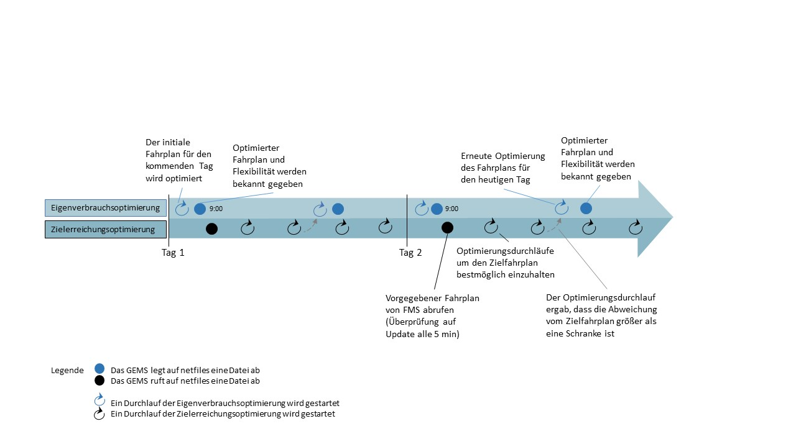

#### Eigenverbrauchsoptimierung

Die Eigenverbrauchs-Optimierung erfolgt am Vortag für den kompletten Folgetag und als Ergebnis werden der initiale Fahrplan und die Flexibilität als „schedule_initial.csv“ auf der Datenaustauschplattform für das FMS abgelegt. 
Die Eigenverbrauchs-Optimierung kann außerdem gestartet werden, wenn die Abweichung vom aktuell vorgegebenen Fahrplan größer als eine vordefinierte Schranke ist. Diese Optimierung findet (in der im Feld genutzten Konfiguration) frühestens alle 12 Stunden statt und als Ergebnis wird ein Update des Fahrplans als „schedule_update.csv“ auf der Datenaustauschplattform abgelegt.
Das Ziel dieser Optimierung ist stets die Maximierung des Eigenverbrauchs. Außerdem dienen die resultierenden Fahrpläne für die einzelnen Geräte zur Festlegung der aggregierten Flexibilität, welche zur Kommunikation mit dem FMS genutzt wird.

#### Zielerreichungsoptimierung

Die Zielerreichungsoptimierung hat zum Ziel, den vorgegebenen Fahrplan „schedule_target.csv“ oder gegebenenfalls das Update des Fahrplans „schedule_target_update.csv“ möglichst exakt einzuhalten.

Diese Optimierung beginnt, wenn einer der folgenden Fälle eintritt, mit der Einschränkung, dass sie frühestens nach 15 Minuten wieder durchgeführt werden darf.
- Ein neuer Zielfahrplan oder ein Update wurde von FMS erhalten
- Es ist Mitternacht
- Die Flexibilität hat sich geändert
- Die dynamische Flexibilitätsanpassung schlug fehl

Nach der Optimierung wird die erwartete maximale Abweichung vom Zielfahrplan ausgewertet. Falls sich der Betrag der maximalen Abweichung über einer vordefinierten Schranke befindet, wird eine erneute Eigenverbrauchsoptimierung gestartet, um ein Update des eigenen Fahrplans und der Flexibilität an das FMS zu senden. Dieses kann nun einen neuen, aktualisierten Zielfahrplan bereitstellen. Diese Updatefunktion wurde jedoch nicht im Rahmen des Projekts genutzt.

#### Fahrplanumsetzung

Die Flexibilität wird durch einen Regelkreis, einmal pro Minute, dynamisch angepasst. Das Intervall lässt sich frei konfigurieren, wurde jedoch aufgrund vergleichsweise hoher Latenzen des Batteriespeichers auf eine Minute fixiert. Hier wird die Differenz zwischen dem Zielfahrplan und der durchschnittlichen Last berechnet, um anhand dieser Abweichung anschließend die Anpassung der Flexibilität vorzunehmen. Tritt ein Problem bei dieser Anpassung auf, so wird eine neue Zielerreichungsoptimierung gestartet.
 

### Flexibilität

Gemäß [mauser2017defintion] verstehen wir Flexibilität als die Menge der Lastprofile, die ein System (hier der Batteriespeicher oder das Gebäude inkl. dem Batteriespeicher) erreichen kann, ohne dabei den Betrieb zu gefährden. Diese Menge wird durch das GEMS als Korridore für Energie und Leistung abgebildet. Für den gebäudeinternen Gebrauch wird das Modell außerdem um einige Parameter erweitert, um es auch auf andere Geräte als Speicher anwendbar zu machen. Zunächst wird jedoch das grundsätzliche Vorgehen dargestellt:

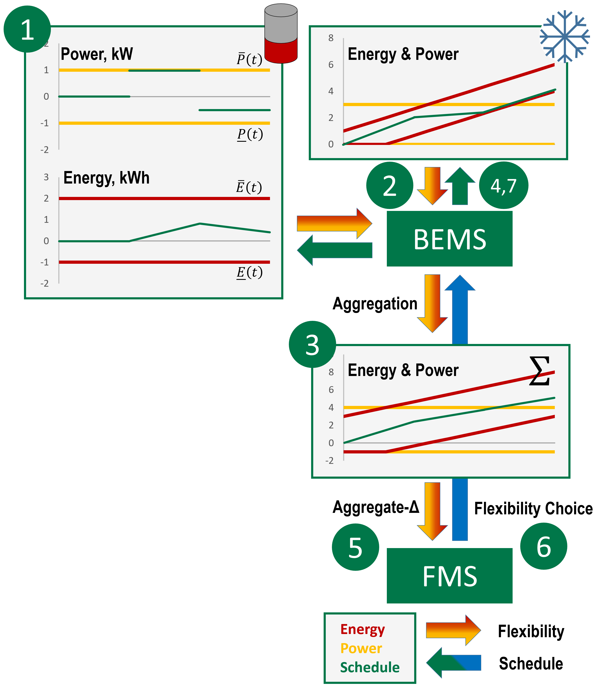

Der Austausch der Flexibilität erfolgt über eine generische Schnittstelle. Hierbei wird eine aggregierte Flexibilität an das FMS gemeldet. 

1. Flexibilität wird durch die eigenständigen Treiber mit Hilfe von Vorhersagen, Nutzerinputs und anderen operativen Bedingungen festgelegt.
1. Diese Flexibilität wird vom GEMS gesammelt.
1. Auf Basis von Vorhersagen wird der Eigenverbrauch maximiert und durch die bereitgestellten Fahrpläne wird eine aggregierte Flexibilität erstellt.
1. Die geplanten Geräte-Fahrpläne werden an die Gerätetreiber gegeben.
1. Fahrplan und aggregierte Flexibilität werden separat an das FMS gesendet.
1. Das FMS entscheidet über die Flexibilität und sendet einen Fahrplan zurück.
1. Das GEMS passt die Vorgaben des FMS in Echtzeit an.

Es ist zu unterscheiden zwischen dem internen und dem externen Flexibilitätsmodell. Bei dem internen wird die Flexibilität jedes Treibers einzeln gesammelt und möglichst genau abgebildet (siehe oben Punkt 2).
Zur Kommunikation mit dem FMS dient die externe Flexibilität, welche eine Aggregation der einzelnen ist (siehe oben Punkt 3). 

Eine Flexibilität der internen Modellierung hat folgende Parameter:

- Identifikationsnummer
- ID der dazugehörigen Aufgabe
- Ist die daraus gebildete Aufgabe während der Laufzeit anpassbar
- Stoppzeit einer Aufgabe, die durch diese Flexibilität gebildet wurde, als Intervall zweier Zeitpunkte: [Min, Max]
- Laufzeit in Sekunden als Intervall: [Min, Max]
- Korridore, deren Werte im Abstand von maximal 15 Minuten aktualisiert sind und den minimalen und maximalen Grenzen entsprechen (siehe auch die [FMS Schnittstelle](#interfaces_fms))
  - Leistungskorridor, der dem realisierbaren Leistungsverbrauch abhängig von der Zeit entspricht, abgebildet durch das Intervall [P̲ (𝑡),P̅(𝑡)]
  - Energiekorridor, der dem realisierbaren Energieverbrauch abhängig von der Zeit entspricht, abgebildet durch das Intervall [E̲ (𝑡),E̅(𝑡)]

Der Korridor der Leistung bildet eine Treppenfunktion, bei der maximal alle 15 min die Grenzen aktualisiert werden. In folgender Abbildung entspricht zum Beispiel die untere Grenze genau der oberen Grenze und realisiert damit ein festes Lastprofil. Die Energie ist als Integral über der Leistung zu erkennen. Sie ist eine abschnittsweise lineare Funktion. Korridore für Energie sind daher auch abschnittsweise linear.

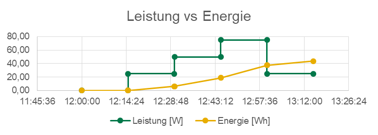

Durch die Intervallparameter Stoppzeit und Laufzeit kann für die vorhandenen Geräte eine variable Dauer oder Endzeitpunkt festgelegt werden (z.B. Elektrofahrzeug). Da im Feldtest nur ein Batteriespeicher verwendet wird, vereinfachen sich diese Parameter. Die Dauer für eine Flexibilität ist immer die eines ganzen Tages (Dauer von 0 Uhr bis 0 Uhr am Folgetag) und die Stoppzeit ist das Ende des Tages.
Am Vortag wir ein Flexibilitätsabbild für den folgenden Tag erstellt. Dieses wir im Laufe des betreffenden Tages immer wieder aktualisiert, sobald das GEMS das Flexibilitätsabbild erneut abruft.

Die aggregierte Flexibilität der externen Modellierung gibt an, wie sehr vom Plan abgewichen werden kann. Dabei fallen Dauer und Stoppzeit weg, sodass nur der Leistungs- und Energiekorridor bleibt. Diese werden durch Aufaddieren der einzelnen Flexibilität erzeugt, was sich hier im Modell einfach realisieren lässt, da Stoppzeit und Dauer nicht variabel genutzt werden. Es ist jedoch zu beachten, dass der Leistungskorridor ggf. eingeschränkt werden muss, da in besonderen Fällen sonst die aggregierte Flexibilität größer als die tatsächlich vorhandene Flexibilität ist.

### Prognose

Um Fahrpläne und die Flexibilität prognostizieren zu können benötigt das GEMS Prognosen von Verbrauch und PV-Erzeugung. Beide Prognosen werden auf Basis historischer Daten generiert. Hierzu werden die letzten n typgleichen Tage aus der Vergangenheit herangezogen. Typen können beispielsweise Wochentag, Samstag und Sonntag sein. An einem Samstag ist der zu prognostizierende Tag ein Sonntag und die vergangenen _n_ Sonntage werden in die Prognose mit einfließen. Da hinsichtlich der Sonneneinstrahlung keine direkte Abhängigkeit vom Wochentag existiert, werden in der PV-Prognose schlicht die letzten _n_ Tage berücksichtigt. Falls nicht alle notwendigen Daten vorliegen nutzt das GEMS die letzten _k_&lt;_n_ vollständig vorliegen Tage.

### Output/ Ausgangsgrößen (z.B. Durchführung von Steuerbefehlen) 
Als Output werden Steuerbefehle an den Batterietreiber geschickt. Der initiale Fahrplan und Flexibilität werden ebenso als Output für das FMS auf der Datenaustauschplattform abgelegt. Die Messwerte werden in der InfluxDB in kurzen Abständen gespeichert und in einem externen Datenspeicher in größeren Abständen (siehe oben).

### Visualisierung 

Um den Teilnehmern am Projekt Grid-Control einen einfachen Zugang zu ihren Daten zu ermöglichen, können Sie über ein Tablet die aktuellen Stromflüsse im Haushalt nachverfolgen.
In einer Übersicht kann die aktuelle Ladung im Speicher und die Stromflüsse betrachtet werden.

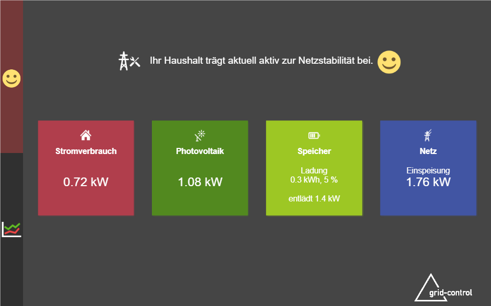

In einer Detailansicht kann man die Stromflüsse über der letzten 24 Stunden betrachten.

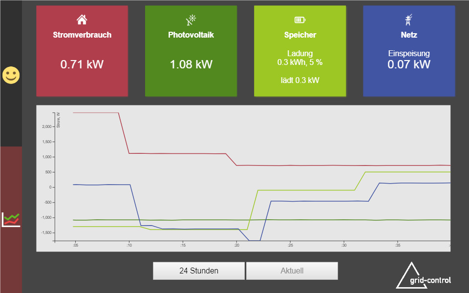

### Datenaustauschplattform

Der Austausch zwischen GEMS und den externen Systemen erfolgt über die Datenaustauschplattform und wird in den jeweiligen Kapiteln in diesem Dokument beschrieben.

### Offene Use Cases/ Forschungsbedarf der Out Of Scope war

Wie schon unter den Annahmen und Vereinfachungen erwähnt, wird angenommen, dass die Prognosen für den Stromverbrauch, sowie -Erzeugung perfekt sind. In der Weiterentwicklung sollte die Stochastik in der Prognose Berücksichtigung finden, um eine realitätsgetreuere Modellierung zu erreichen und das Ergebnis der Optimierung robuster zu machen. Des Weiteren ließe sich so eine Basis zur Abgabe von Garantien schaffen.

Der Optimierungsprozess erlaubt es dem GEMS bei einer zu hohen Abweichung bei der Umsetzung vom Zielfahrplan, eine erneute Eigenverbrauchsoptimierung zu starten. So wird eine Intra-Day Updateversion des Fahrplans und des Flexibilitätsangebots für das FMS generiert. Zu dieser Updatefunktion ist das GEMS also theoretisch in der Lage, sie ist jedoch nicht in allen im Feldtest genutzten Systemen implementiert und die Funktionalität daher ungenutzt. 

Zusätzlich ist eine Weiterentwicklung der Optimierung, um die Flexibilitätserbringung zuverlässiger zu machen, sinnvoll. Dies kann durch den Einbezug von Ampelinformationen in der Optimierung und Planung geschehen, denn die aktuelle Annahme in der Optimierung ist, dass kein Rot auftritt.

Weiteres Potential bietet sich durch die Nutzung von intelligenten Messsystemen, welche beispielsweise die Erfassung und Weiterleitung von Steuersignalen und Informationen übernehmen können.

Ansonsten gibt es Forschungsbedarf zur Weiterentwicklung der Plattformen zum reellen Einsatz und damit einhergehend die Weiterentwicklung der Schnittstellen.

## Erprobung des Systems 

### Notwendige Anpassungen
Während dem Feldtest wurden Fehler verschiedenster Art identifiziert und behoben. Im Folgenden wird nur auf die einige Fehler eingegangen. 

Im Laufe des Feldtests wurde festgestellt, dass es mehr Bedarf an Diagnosedaten gibt, welche anschließend durch neu implementierte Ausgaben bereitgestellt werden konnten. Diese dienen dazu, die aktuellen Werte und Vorgänge besser nachzuvollziehen und mögliche Fehlerquellen schneller zu entdecken.

In der Planung wurde außerdem angenommen, dass die Batteriespeicher alle das gleiche Interface unterstützen. Jedoch gab es ein Interface für 3-phasig angebundene Speicher und ein separates für 1-phasig angebundene Speicher. Da das REMS nicht zwischen diesen Unterscheidet übernimmt das GEMS die „Übersetzung“.

Ursprünglich sollte in der roten Ampelphase der Batteriespeicher durch das REMS angesprochen werden. Das GEMS beendet hierzu die Verbindung zum Speicherinterface und gibt dieses somit für das REMS frei. Die Koordination zwischen GEMS und REMS hat sich jedoch in den Tests als schwierig herausgestellt, da die GCU regelmäßig auch in der grünen und gelben Ampelphase den Zugriff auf den Speicher blockiert, um von diesem Informationen zu seinem Zustand zu erfragen. Die Lösung hierzu ist, dass das GEMS als Ansprechpartner für die Steuerung und den Status des Batteriespeichers fungiert. Die folgenden Abbildungen stellen dies dar. Verlauf des Steuersignals im Fall, dass Ampelphase rot (geplant):

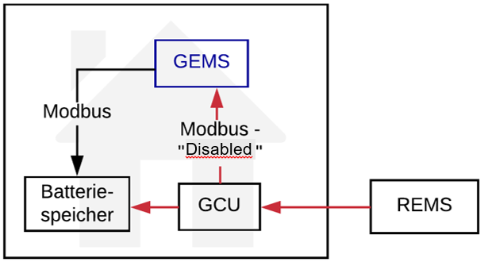

Verlauf des Steuersignals im Fall, dass Ampelphase rot (nach Anpassung):

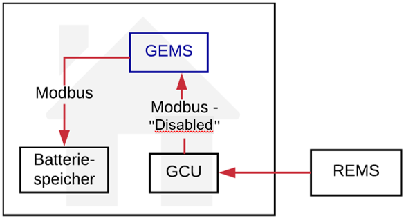

Ein weiterer Grund für diese Anpassung ist, dass die Autonomie des Haushalts nun gewahrt bleibt, da das GEMS über die Steuerung entscheidet.

Als dritter Punkt der eine spätere Anpassung erforderte, ist die Planung der Zähler im Haushalt zu nennen. Das System war so konzipiert, dass es je einen Zähler für die Photovoltaikanlage (PV), die Verbrauchsgeräte und den Batteriespeicher gibt. 
In manchen Haushalten wurden jedoch Überschusszähler installiert, welche den Strom erst nach der PV und den Verbrauchsgeräten aggregiert zählen. So wird nur die Summe der PV und der Verbrauchsgeräte berechnet, das GEMS jedoch benötigt die beiden Werte getrennt in ihrer Stromerzeugung bzw. –verbrauch für die Optimierung. Aus diesem Grund wurde eine nachträgliche Verrechnung mit einem dritten Zähler, welcher die PV Produktion misst, implementiert.

### Flexibilitätserbringung

Der Feldtest zeigt, dass die durch dezentrale, private Energiemanagementsystem verwaltete Flexibilität kann gezielt durch übergeordnete Systeme gelenkt werden. Durch die Vorgabe von Ziel-Fahrplänen an das GEMS besteht eine erhöhte Planungssicherheit, sofern diese auch zuverlässig eingehalten werden. Folgende Box-Plots zeigen exemplarisch die Verteilung der tagesweise berechneten mittleren absoluten Fehler (MAE) von Ziel-Fahrplan und erbrachtem Lastprofil für den Zeitraum von August 2017 bis August 2018. Beide Gebäude (nummeriert nach dem virtuellen Zählpunkt) wurden mit einem Speicher ausgestattet, der mit bis zu 4,6kW Leistung (ent-)laden kann.

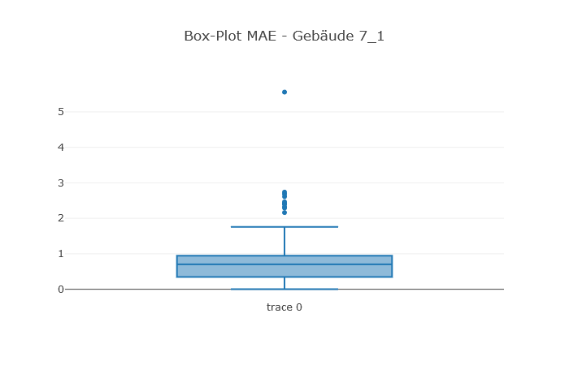
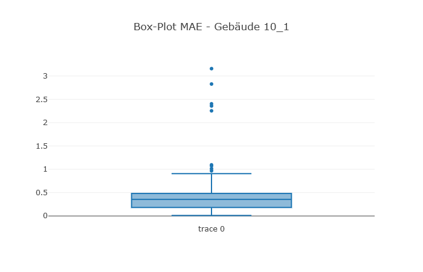

Wie den Grafiken entnommen werden kann, kann (tageweise betrachtet) das Lastprofil der Gebäude vergleichsweise exakt beeinflusst werden, denn in über 75% der Tage konnte ein MAE von 1 kW oder weniger erreicht werden. Nur für wenige Tage überschreitet die mittlere absolute Abweichung 2 kW. Die Ergebnisse für die nicht aufgelisteten Gebäude und den Quartierspeicher sind bei Betrachtung der Abweichung in Relation zur Nennleistung des genutzten Speichers vergleichbar. Als Hauptgründe für Abweichungen wurden Prognoseungenauigkeiten und Regelungsfehler identifiziert. Regelungsfehler können vielseitige Gründe haben. Unter anderem konnten manche Batteriespeicher wiederholt nicht angesprochen werden, aber auch Fehler in der im GEMS implementierten Regelung können nicht vollkommen ausgeschlossen werden. Da es mit den aufgezeichneten Messwerten nicht möglich ist solche Tage zu filtern, sind diese in den Auswertungen enthalten. Aber in der überwiegenden Anzahl der Tage zeigt sich, dass durch ungenaue Prognosen große Abweichungen hervorgerufen können. Bei einer fehlerhaften Prognose steht im Laufe des Tages Flexibilität nicht im erwarteten Maß zur Verfügung. Verbesserungen können jedoch durch mehrere Maßnahmen erzielt werden: Zunächst würde durch eine später durchgeführte Prognose die Unsicherheit über den Anfangszustand reduziert werden. Im Feldtest wurden die Prognosen bereits am Morgen des Vortages erzeugt, sodass die Prognose des Anfangszustandes um 12 Uhr in der Nacht mit einer deutlichen Unsicherheit belastet ist. Ein zeitnäheres Angebot (wenige Minuten bis Stunden) wäre durchaus denkbar. Ein weiterer Faktor ist die Länge des Prognosehorizonts, entweder kann dieser Verkürzt werden, oder es sollte ein Mechanismus eingesetzt werden, der Aktualisierungen ermöglicht. Das GEMS implementiert einen solchen Mechanismus bereits, welcher aber mangels Unterstützung anderer Systeme nicht genutzt wurde.

Für die verbleibenden Systeme (20 kW und 100 kW) ergibt sich folgendes Bild:

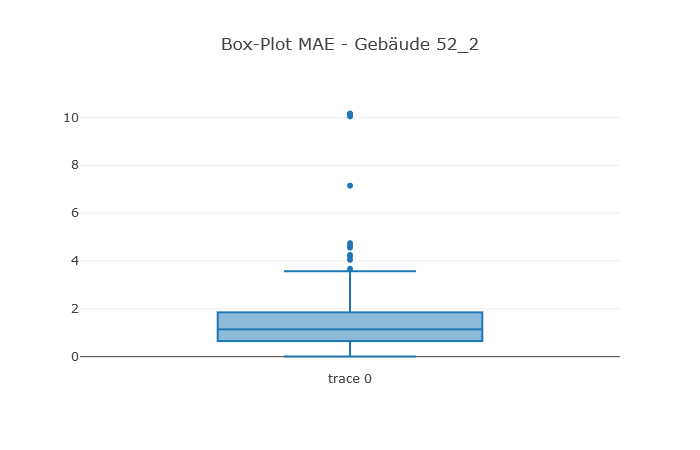

Es sind jeweils 75% der registrierten Abweichungen kleiner oder maximal so groß wie 10% der Nennleistung. Dass die Steuerung bei korrekter Prognose funktioniert macht folgende Grafik des Quartierspeichers deutlich:

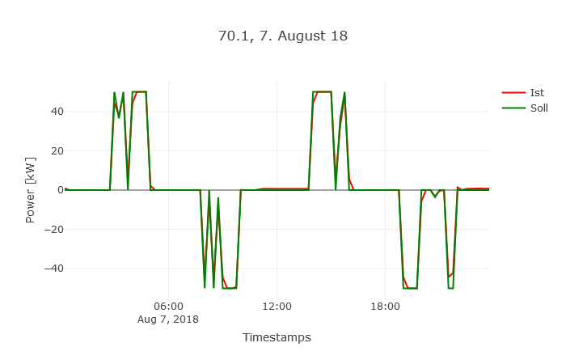
 

### Prognosegüte

Im Abschnitt [Prognose](#functions-forecasts) wird der Prognosealgorithmus erläutert.
Bei der Bewertung der Prognosen wurde für den Stromverbrauch jeder Wochentag als eigener Typ gewählt.
Es werden außerdem nur Tage berücksichtigt, für die eine vollständige Datenbasis vorhanden ist.

Auf dieser Basis wurden die Prognosen ausgewertet. Exemplarisch sei hier der virtuelle Zählpunkt 66 dargestellt, da die Daten hier nur eine Lücke im Juni aufweisen. Für die anderen Zählpunkte ergibt sich ein sehr ähnliches Bild. Es sei angemerkt, dass der zum vZP gehörige Haushalt nicht mit einem Batteriespeicher ausgestattet war, was aber für die Evaluation des Prognosealgorithmus unerheblich ist.

Beginnend mit der Verbrauchsprognose sind nachfolgend ein Histogram und ein Boxplot zur Verteilung der viertelstündlichen Fehler über den betrachteten Zeitraum von 21.09.2017 bis 26.08.2018 (fehlende Messwerte und Tage mit unvollständiger Datenbasis ausgenommen) abgebildet. 

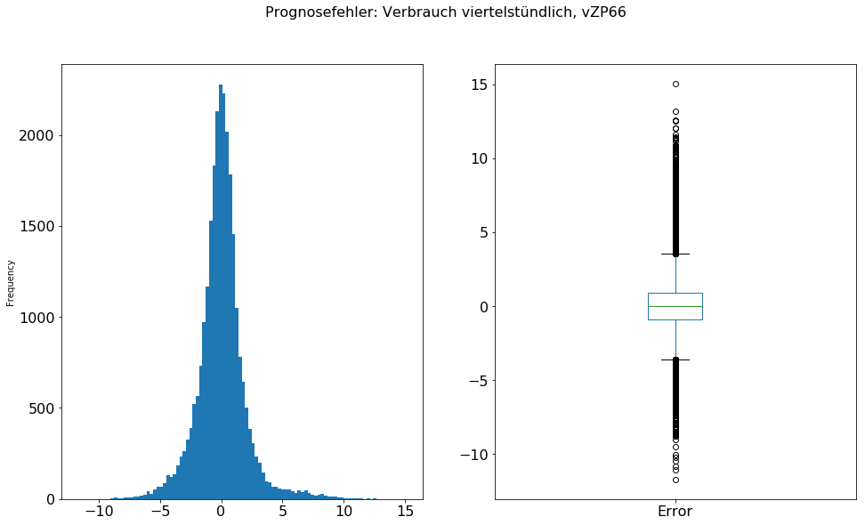

Im Median liegt der Fehler bei etwa 0 und 50% der Fehler befinden sich im Intervall -0.91 bis 0.88 kW. Auch ist die Fehlerverteilung eher symmetrisch um die 0. Bei einigen vZP ergibt sich eine leichte schiefe Verteilung mit Median 0 und einem im Vergleich zum unteren Quartil weiter von der 0 entfernten oberen Quartil. Das bedeutet, dass falls der Stromverbrauch unterschätzt wurde, er tendenziell etwas stärker unterschätzt wurde als er im entgegengesetzten Fall überschätzt wurde. Insgesamt ist aber keine systematische Verzerrung zu erkennen.
Mit dem MAE der einzelnen Tage im betrachteten Zeitraum ergibt sich folgendes Bild:

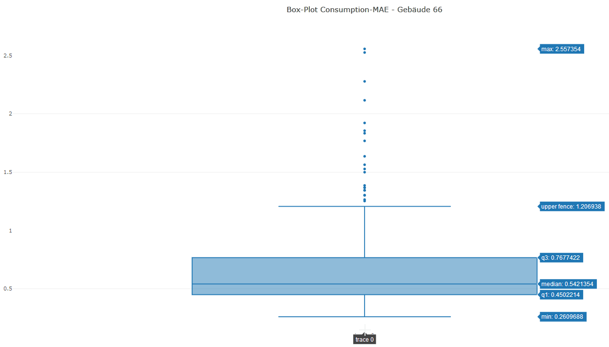

Der mittlere absolute Fehler im Tagesablauf überschreitet in 75% der Tage nicht 0.77kW. Es gibt jedoch Ausreißer, mit bis zu 2.6kW. Diese sind durch ein stark verändertes Verbrauchsverhalten verursacht. Die beiden größten im Bild zu sehenden Ausreißer sind beispielsweise durch eine starke Überschätzung der Nachfrage entstanden, da in den beiden vorherigen Referenztagen deutlich mehr Strom verbraucht wurde. Alleine aus den Messwerten lässt sich keine direkte Aussage darüber treffen, wie das Modell potentiell verbessert werden kann, abseits von einer genaueren Erfassung des Nutzerverhaltens.
Bezüglich der PV Produktion ergibt sich folgendes Bild:

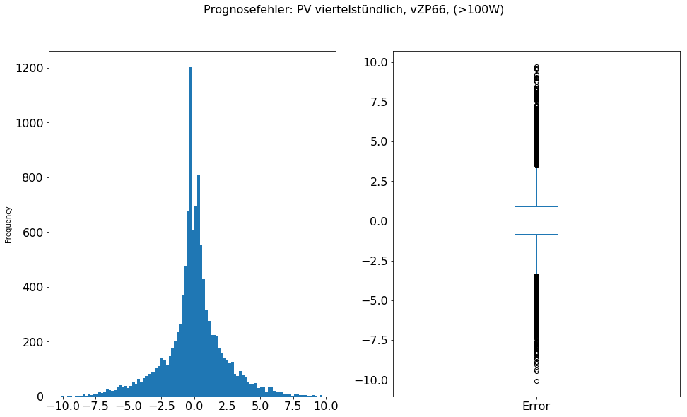

Nicht enthalten sind 18.556 Prognosen mit einem Fehler kleiner 100 Watt, da diese ansonsten die Verteilung stark dominieren und so das Bild verzerren. Die hohe Anzahl ist darin begründet, dass die korrekte Vorhersage bei Nacht trivial ist. Durch das Filtern sind außerdem die Stromflüsse von bis zu 28 W, welche nachts in entgegengesetzter Richtung aufgetreten aus der Auswertung herausgenommen. Der Median-Fehler beträgt -0.124 kW, was auf eine geringe, aber systematische Unterschätzung der tatsächlichen Erzeugung hinweist. Das untere und obere Quartil sind in diesem Fall bei -0.83 kW und 0.92 kW. Dies bedeutet, dass über 50% der Prognosen einen Fehler von weniger als 0.92kW aufweisen. Die größte gemessene Einspeisung lag bei 11,74 kW. Die größten Fehler bei etwa 10kW entsprechen somit einer extrem starken Fehlprognose und sind durch Wetterumbrüche (Verdunklung durch Wolken) zu erklären. Hierzu muss nicht zwangsläufig durchgehend schlechtes oder gutes Wetter vorherrschen, es genügt, wenn wenige zerstreute Wolken an mehreren Tagen zufällig zur gleichen Zeit die Anlage stark verdunkeln. So z.B. für die hier betrachtete Anlage Enge August 2018 wiederholt geschehen. Folglich könnte die PV Prognose stark davon profitieren Wetterprognosen, insbesondere bezüglich der Bewölkung, mit einzubeziehen. 
Zusammenfassend können beide Prognosen mit dem genutzten Verfahren nur eine ungefähre Basis zur Prognose der tatsächlich vorhandenen Flexibilität bilden. Für zukünftige Anwendungen ist dringend empfohlen mindestens eine der folgenden Weiterentwicklungen vorzunehmen:
- Prognosealgorithmen verbessern
- Prognoseungenauigkeit in der Planung berücksichtigen
- Größere Puffer, um trotz unvorhergesehener Ereignisse wie erwartet reagieren zu können

# Literatur
|Kürzel|Quelle|
|-|-|
|[mauser2017definition]|	Mauser, I., Müller, J., Förderer, K., Schmeck, H.: Definition, modeling, and communication of flexibility in smart buildings and smart grids. In: ETG-Fb. 155: International ETG Congress 2017, pp. 605{610. VDE, Berlin, Germany (2017)|

 
 

